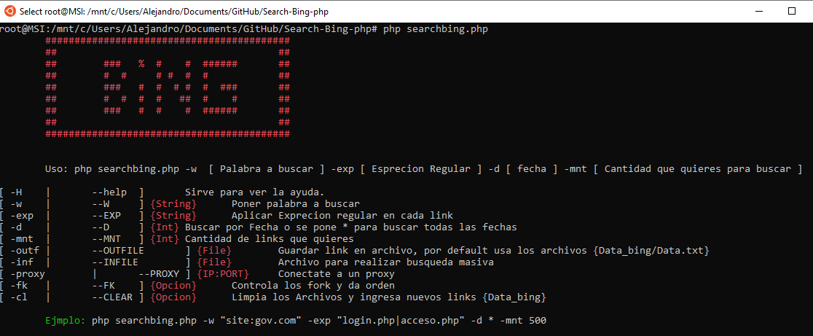
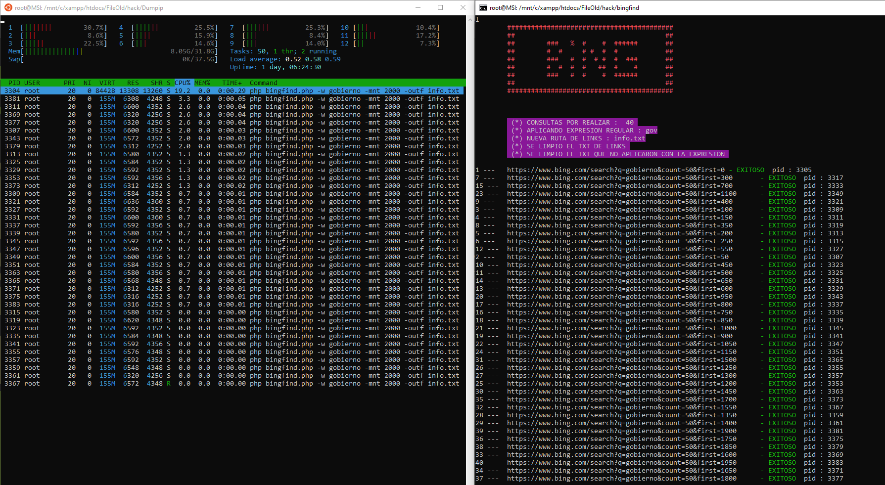

# Search Bing
Ejemplo  de ejecucion :    `  php searchbing.php -w gobierno -mnt 200  -d * -outf info.txt -exp "\.com|\.mx" -cl -fk`  
       ********** PARAMETRO OPCIONAL, LO PUEDES PONER O NO `[ -d ]` 
        * = SE EXTRAERAN TODOS LINK ENCONTRADOS SIN FLITRO DE FECHA  
				1 = SE EXTRAERAN LOS LINK QUE TENGAN UN TIEMPO DE 24 HORAS  
				2 = SE EXTRAERAN LOS LINK QUE TENGAN UN TIEMPO DE SEMANADAS   
				3 = SE EXTRAERAN LOS LINK QUE TENGAN UN TIEMPO DE MESES 

## Ventajas
1.- Utiliza Fork, lo cual divide el trabajo y realiza consultas rapidas 
2.- Elimina Links repetidos 
3.- Puedes filtrar los link con expresiones regulares 
4.- Almacena los resultados en TXT 
5.- Puedes hacer busquedas con fecha y extraer los links mas recientes
6.- Futura actualizacion el uso de proxy

### Funciones y clases que utilizia

( 1 ) [pcntl_fork](https://www.php.net/manual/en/ref.pcntl.php) `Abre Procesos y trabajas con ellos` 
( 2 ) [shmop](https://www.php.net/manual/es/book.shmop.php) `Abre un espacio de memoria y almacena informacion { memoria compartida }` 
( 3 ) [facilcurl](https://github.com/CR0NYM3X/Facil-Curls-PHP)  `Facilita el uso de Curls` 
( 4 ) [class_color](https://github.com/CR0NYM3X/Color-Cli-PHP)  `Agrega color al texto`  
( 5 ) [parcli](https://github.com/CR0NYM3X/Argv-Cli-PHP)  `Trabaja con los parametros que ingresas` 

## Contribuir
Encontraste un error? por favor de publicarlo en [issue tracker](https://github.com/CR0NYM3X/Search-Bing-php/issues).

## Posibles Problemas
1 - Que no encuentre la direccion de memoria compartida que se le especifica y detenga el programa
